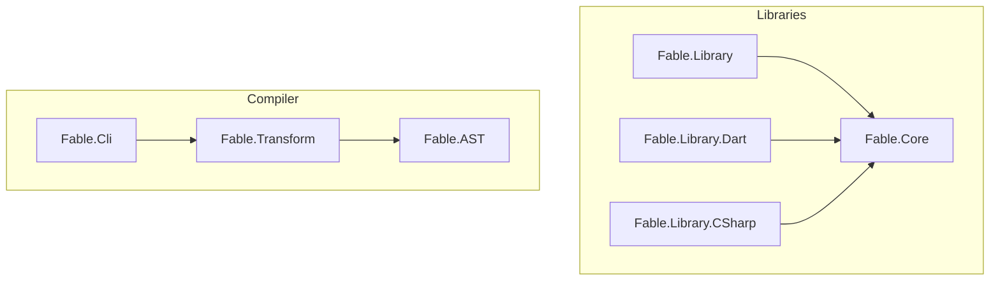

# Adding C# to the Fable Compiler

The Fable compiler is a facinating project.  In it's current state, it's a compiler that targets the six languages!

* JavaScript - beta
* Python - beta
* Dart - beta
* Rust - alpha
* TypeScript - alpha
* PHP - experimental

Not to be left out, I thought it might be fun to add C# to the list and I thought I would share my experience.

## Why C#?

* I've always wanted to learn more about the Fable compiler, so this is personal.
* I often like to solve my problems in F# first and I often find myself porting my F# code to C# to make it more accessible to my team.
* I love how transpilers provide a sense of transparency into the language that traditional compilers don't typically provide and I think that's a great way to learn a language.
* I believe providing a good C# target would provide the optionality a curious C# developer wants before they commit their limited time to learning F#.
* I want to encourage others to check out the Fable project and try adding a new language target or to collaborate on an existing target.

## Bootstrapping a New Language

In order to get started quickly, I figured I would make it easy on myself and use the Dart compiler as a starting point.  This would
expose me to the overall project structure and give me a working compiler to start with.  My goal was to simplly add the C# option to the the Fable command-line and have it compile F# to Dart with a cloned module.

I wanted to be able to run:

```bash
./build.sh quicktest-csharp
```

But first, I'd need to get familar with the build processes and the compiler project structure.

## Fable Compiler Project Structure

Here's a simplified view of the Fable compiler showing the Fable libraries and the Fable compiler itself.




The Fable compiler starts with the CLI.  In order for it to work,

--------

### Compiler Projects

| Project | Description |
| --- | --- |
| Fable.Cli | The command-line interface for the Fable compiler.  This is the entry point for the compiler. |
| Fable.Transform | The Fable compiler.  This is the core of the compiler. |
| Fable.AST | The Fable AST.  This is the AST that the Fable compiler uses. |

-------

### Library Projects

| Project | Description |
| --- | --- |
| Fable.Core | The Fable core library.  This is the core library that the Fable compiler uses. |
| Fable.Library | The Fable library.  This is the library that the Fable compiler uses. |
| Fable.Library.Dart | The Fable library for Dart.  This is the library that the Fable compiler uses when targeting Dart. |
| Fable.Library.CSharp | The Fable library for C#.  This is the library that the Fable compiler uses when targeting C#. |


-------